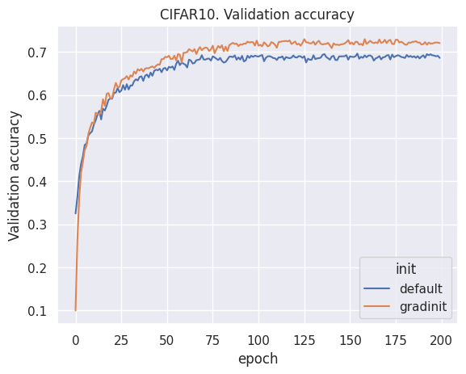
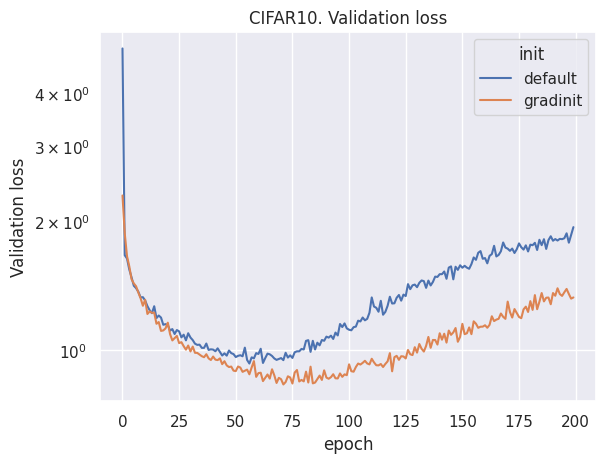

Here we provide some reimplementation of the original paper experiments.

To be more honest with the computation time we added gradinit as the first epoch to the comparing graphs.
For the gradinit initialization, 0 epoch refers to the validation after initialization.
For the default initialization, 0 epoch refers to the validation after the normal training epoch.
So the version with the gradinit used 1 epoch less of real training.

Here is how gradinit influences the training of ResNet-152 on CIFAR10.

